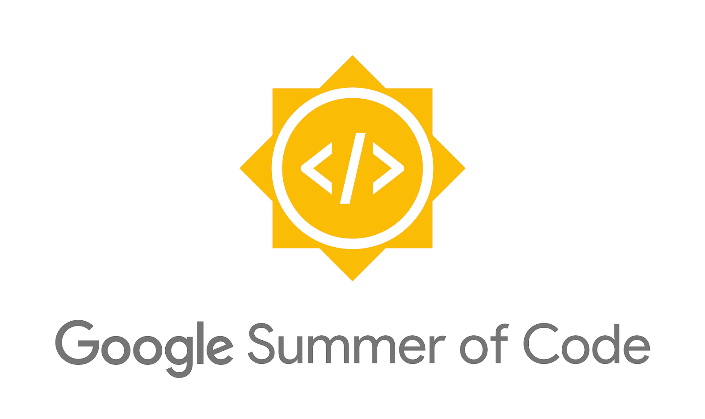

### Introduction
This article will be just words and less fun. Be prepared!
I feel really happy to announce that I have been selected to work under 
[Google Summer of Code](https://summerofcode.withgoogle.com/) internship programme organised every year by Google Inc. to 
make students reach out to Open Source organisations and provide them a wonderful opportunity to grow as Open Source 
developers. This year, the programme is going to start from May 27, 2019 to August 19, 2019. The best thing about this 
programme is that firstly, it is work from home and secondly, on successfully completing it, Google pays you a hefty stipend.
This is supposed to vary from country to country [as mentioned here](https://developers.google.com/open-source/gsoc/help/student-stipends).
I hope to work really hard and satisfy all those goals that I have proposed.

> “Don’t ever let somebody tell you… You can’t do something. Not even me.
All right? … You got a dream… You gotta protect it. People can’t do
somethin’ themselves, they wanna tell you you can’t do it. If you want 
somethin’, go get it. Period.”
-- Will Smith (The Pursuit of Happyness)

### My Organisation
I had only applied in one organisation [FOSSi foundation](https://fossi-foundation.org/). The results came out yesterday (May 6, 2019)
and I was happy that I was one of the 7 students selected for the programme [here.](https://summerofcode.withgoogle.com/organizations/4914571964317696/) 
FOSSi foundation is a wonderful experience for me. 
I started looking at their codebase since early November and contributing shortly after. 
My primary mentor is Phillip Wagner, who is really a wonderful person. He is a very friendly guy - 
I had zero idea about Symfony when I started this and he never made me feel bad about it, not even once. 
He was always there to help. 

### More about stipend
There will be two evaluations as such and a final evaluation after which you're gonna get the stipend and the name. 
Again the stipend that you're gonna get is divided after every phase of evaluation. This year it is 900 USD, 900 USD
and 1800 USD as per first, second and final evaluations respectively.(For India). However stipend is a small thing. Most
of the stuff that matters is recognition, expertise and communication with a large organisation. You are not a single developer
working in your home/school anymore. You are something bigger now. You are now a part of a bigger community. You are now
to help other people reaching out for help.

### Conclusion
This programme is not the end of the world and if you haven't achieved it like many of my friends have, don't worry. Just
keep your composure. Life is very long. You're just 20-22 year old guys. There is still some time to save the world. Believe
in yourself and never lose hope cause Hope is what keeps us alive. If you feel worthless or lose hope, you have lost
miles before you even began. Have confidence and trust the process. Everybody is different. Every circumstance is different.
Who knows you hit a chance a be a millionaire someday. Also, this thirst to strive is why we're alive after all these years.
Darwin would be proud on us. 

A good quote should end this article.
> “Some people can’t believe in themselves until someone else believes in them first.” – Sean Maguire, from Good Will Hunting